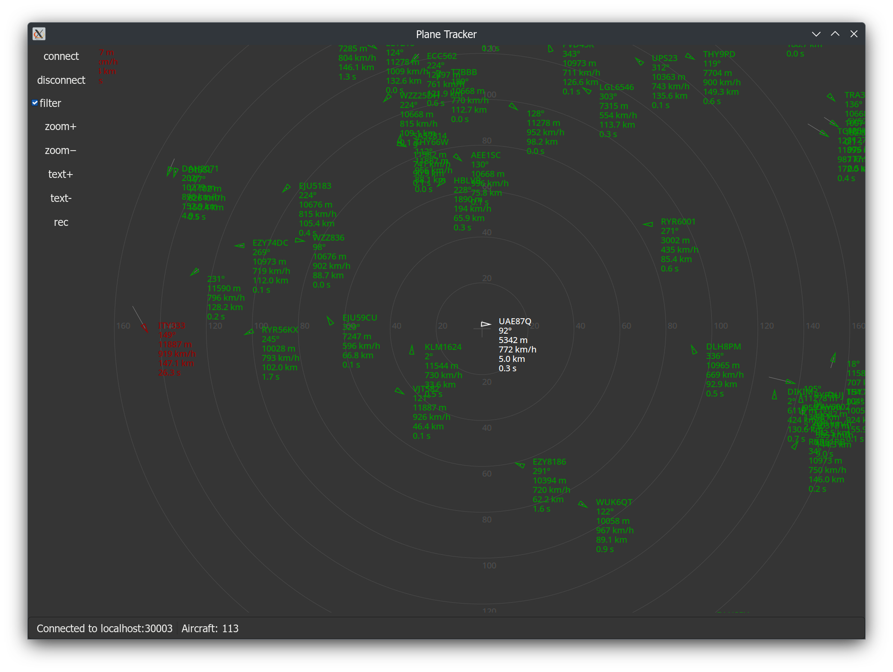

# Plane Tracker
Copyright (C) 2023-2024 Filip Szczerek (ga.software@yahoo.com)

*This program is licensed under MIT license (see LICENSE.txt for details).*




# Introduction

Plots aircraft based on received SBS messages.


# Building

Building `plane-tracker` requires the Rust toolchain and GTK4 development libraries.


# Usage

The `dump1090` tool can be used as a data source; e.g., plug in an RTL-SDR dongle and run:
```
$ dump1090 --net --interactive
```
then launch `plane-tracker` (e.g., `cargo run --release`) and connect to `localhost:30003`.

The observer location (format: `<lat.>;<lon.>;<elevation in meters>`) is set via the configuration file `plane-tracker.cfg` (on Linux, found in `~/.config`), e.g.:
```
[Main]
ObserverLocation=11.345678;12.345678;500
```
